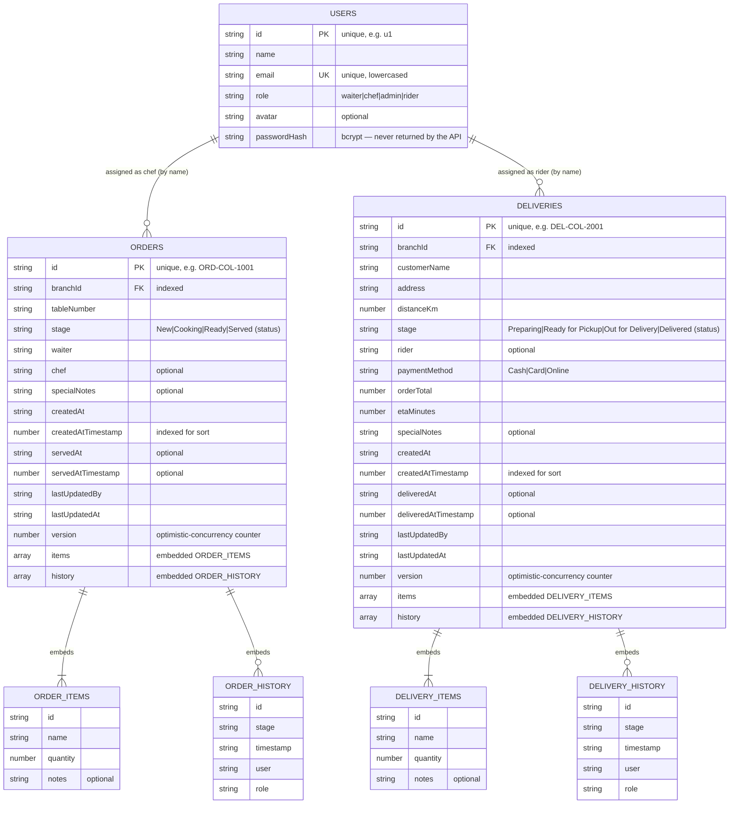

# KitchenSync — Data Model

MongoDB (via Mongoose) with three collections: **users**, **orders**, **deliveries**.
Entities use their own **string `id`** as the primary key (e.g. `ORD-COL-1001`) — Mongo's
`_id`/`__v` are stripped from every API response. `orders` and `deliveries` **embed**
their `items` and `history` as subdocuments. Both carry a `version` integer for
optimistic concurrency and a `branchId` linking them to a branch.

## Indexes

| Collection | Index | Serves |
|---|---|---|
| users | `{ id: 1 }` unique | primary-key lookup |
| users | `{ email: 1 }` unique (lowercased) | login / register duplicate guard (→ 409) |
| orders | `{ id: 1 }` unique | `findById`, PATCH/DELETE |
| orders | `{ branchId: 1, stage: 1 }` | `/orders/stats` aggregation + stage-filtered board reads |
| orders | `{ branchId: 1, createdAtTimestamp: -1 }` | `findAll(branchId)` newest-first |
| deliveries | `{ id: 1 }` unique | `findById`, PATCH/DELETE |
| deliveries | `{ branchId: 1, stage: 1 }` | `/deliveries/stats` aggregation + stage-filtered reads |
| deliveries | `{ branchId: 1, createdAtTimestamp: -1 }` | `findAll(branchId)` newest-first |

> `stage` is this domain's "status" field; `createdAtTimestamp` is the sortable numeric
> form of `createdAt`.

## Aggregation

`GET /api/orders/stats?branchId=…` and `GET /api/deliveries/stats?branchId=…` run a real
Mongo pipeline — `$match` (branch) → `$group` (by `stage`, and by `chef`/`rider` with
`$ifNull → "Unassigned"`) → `$sort` — returning `{ branchId, total, byStatus[], byChef|byRider[] }`.
In memory mode the same shape is computed in code so the endpoint behaves identically.
